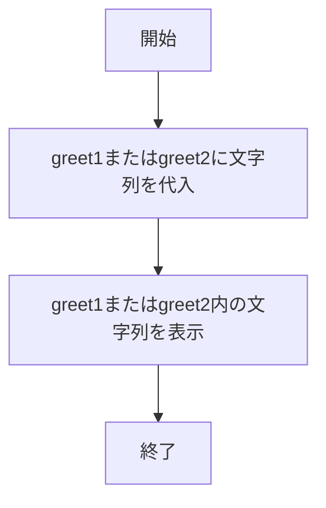
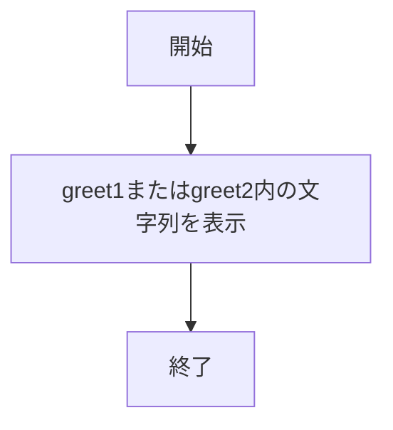
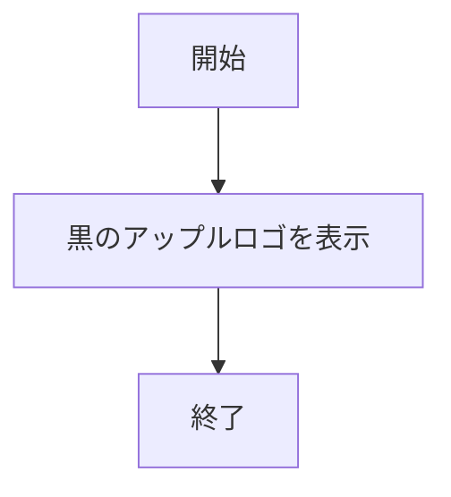
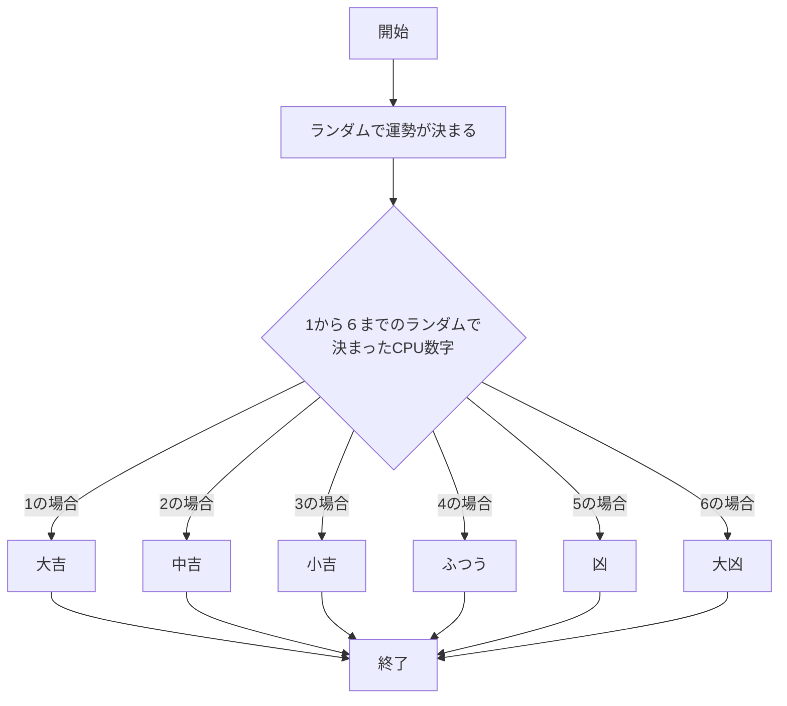
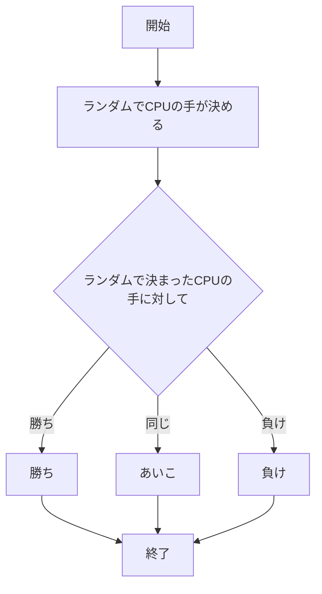
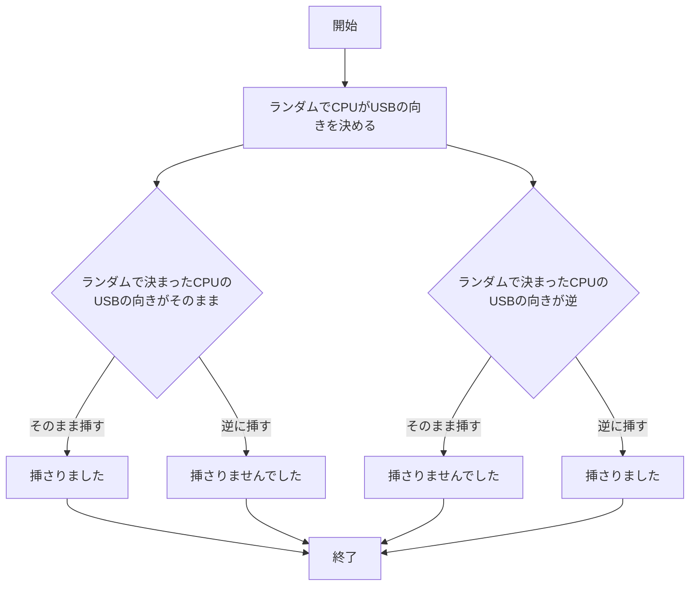
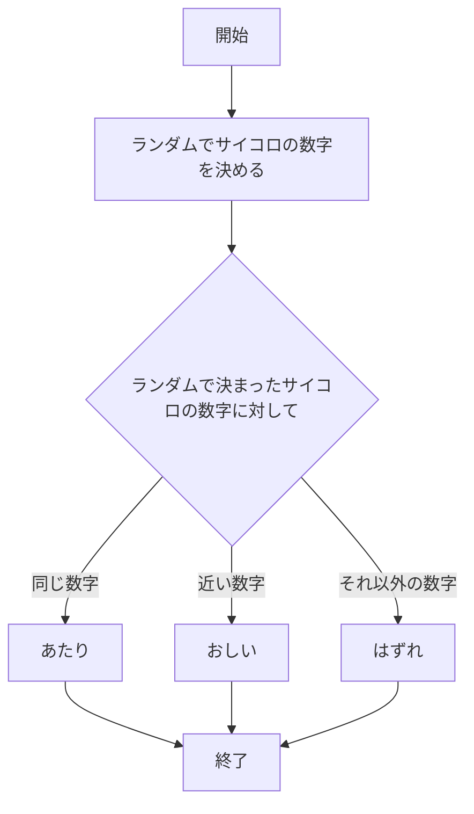

# webpro_06

## ファイル一覧
ファイル名 | 説明
-|-
app5.js| プログラムの本体
public/janken.html | じゃんけんの開始画面
public/USB.html | USBの開始画面
public/dice.html | サイコロの開始画面
public/Apple_logo_black.svg | 黒のアップルロゴ
views/show.ejs | hello1,hello2のテンプレートファイル
views/luck.ejs | 運試しのテンプレートファイル
views/janken.ejs | じゃんけんのテンプレートファイル
views/USB.ejs　|　USBのテンプレートファイル
views/dice.ejs　|　サイコロのテンプレートファイル

## このプログラムについて 
### このプログラムの起動方法について

#### このプログラムの起動方法
1. ターミナル上で，```node app5.js```と入力して```app5.js```を起動する．
1. ```Example app listening on port 8080!```と表示されたら起動完了

#### web上で起動する方法
1. ```http://localhost:8080/```の後ろにapp.get内の文字を入力する．

それぞれのURLを以下の表にまとめておく．

app5.js内のプログラム | URL
-|-
メッセージを表示1 | http://localhost:8080/hello1
メッセージを表示2 | http://localhost:8080/hello2
黒のアップルロゴを表示 | http://localhost:8080/icon
運試し | http://localhost:8080/luck
じゃんけん | http://localhost:8080/janken
USB | http://localhost:8080/USB
サイコロ | http://localhost:8080/dice


### ```app5.js```内のプログラムについて

#### webブラウザにメッセージを表示する機能その１

##### 利用の仕方

この機能の利用の仕方はブラウザを開き，URLに http://localhost:8080/hello1 と打ち込むことで利用できる．利用中はwebブラウザにメッセージが表示される．

##### プログラムの説明

```javascript
app.get("/hello1", (req, res) => {
```
から
```javascript
  res.render('show', { greet1:message1, greet2:message2});
});
```
というプログラム内がメッセージを表示するプログラムである．
プログラム内部でmessege1とmessage2にそれぞれ，Hello WorldとBon jourが代入されている．

フローチャートは以下の通りである．



#### webブラウザにメッセージを表示する機能その２

##### 利用の仕方

この機能の利用の仕方はブラウザを開き，URLに http://localhost:8080/hello2 と打ち込むことで利用できる．利用中はwebブラウザにメッセージが表示される．

##### プログラムの説明

```javascript
app.get("/hello2", (req, res) => {
  res.render('show', { greet1:"Hello world", greet2:"Bon jour"});
});
```
もhello1と同じく，メッセージを表示するプログラムであるが，直接表示するプログラムである．

フローチャートは以下の通りである．



#### webブラウザに画像を表示する機能

##### 利用の仕方

この機能の利用の仕方はブラウザを開き，URLに http://localhost:8080/icon と打ち込むことで利用できる．利用中はwebブラウザに画像が表示される．

##### プログラムの説明

```javascript
app.get("/icon", (req, res) => {
  res.render('icon', { filename:"./public/Apple_logo_black.svg", alt:"Apple Logo"});
});
```
は画像を表示させるプログラムである.
filename:にある./public/Apple_logo_black.svgを表示させるプログラムである．

フローチャートは以下の通りである．



#### webブラウザ上で運試しをする機能

##### 利用の仕方

この機能の利用の仕方はブラウザを開き，URLに http://localhost:8080/luck と打ち込むことで利用できる．webページには今日の運勢とデバッグ用に数字が表示される．ページを開き直すと運勢とデバッグ用の数値が変わる．

##### プログラムの説明

```javascript
app.get("/luck", (req, res) => {
```
から
```javascript
  res.render( 'luck', {number:num, luck:luck} );
});
```
というプログラム内が運試しを行うプログラムである．
内部では，運勢をランダムで決め，それを表示させる.またターミナル上のログに，どのように表示されたかを表示させる．

luckの中身のフローチャートは以下の通りである．



#### webブラウザ上でじゃんけんをする機能

##### 利用の仕方

この機能の利用の仕方はブラウザを開き，URLに http://localhost:8080/janken と打ち込むことで利用できる．利用の仕方は入力欄に```グー```，```チョキ```，```パー```，のいずれかを入力し，送信することで利用することができる．入力し，送信したあと，自分の出した手，相手が出した手，勝敗結果が表示され，何試合行ったか，また何勝したかについても表示される．

##### プログラムの説明

```javascript
app.get("/janken", (req, res) => {
```
から
```javascript
  res.render( 'janken', display );
});
```
というプログラム内がじゃんけんを行うプログラムである．
内部では，はじめに保存用の変数を置いておく．それぞれフォームより入力されたデータを保存する変数，何試合行ったかの回数を保存する変数，何回勝ったか回数を保存する変数，判定を保存する変数がある．次にターミナル上で，ログを残す様にしてある．ログに残る内容は，入力された手，勝利回数，試合回数の３つがログに残る．
次には，CPUがどの手を出すかランダムで決められるプログラムが組まれている．その後に，CPUが出した手に対して，フォームより入力された手が勝ったか，負けたか，それともあいこだったかを判定する．

jankenの中身のフローチャートは以下の通りである．




#### web上でUSBの接続を試みる機能

##### 利用の仕方

この機能の利用の仕方はブラウザを開き，URLに http://localhost:8080/USB と打ち込むことで利用できる．利用の仕方は入力欄に```そのまま挿す```か```逆に挿す```のどちらかを入力し，送信することで利用することができる．入力し，送信したあと，USBをどう挿したか，もともとUSBが逆だったか，そうでなかったか，挿入できたかの判定が表示され，何回試みたか，また何回挿入できたかについても表示される．

##### プログラムの説明

```javascript
app.get("/USB", (req, res) => {
```
から
```javascript
  res.render( 'USB', display );
});
```
というプログラム内がUSBを行うプログラムである．
内部では，はじめに保存用の変数を置いておく．それぞれフォームより入力されたデータを保存する変数，何回挿そうとしたかの回数を保存する変数，何回挿せたかの回数を保存する変数，判定を保存する変数がある．次にターミナル上で，ログを残す様にしてある．ログに残る内容は，入力された向き，挿せた回数，何回挿そうとしたかの回数の３つがログに残る．
次には，CPUがUSBの向きをランダムで決める．その後に，CPUが出したUSBの向きに対して，フォームよりUSBの向きが合っているか，合っていないかを判定する．

USBの中身のフローチャートは以下の通りである．


#### webサイコロをの数字を予想する機能

##### 利用の仕方

この機能の利用の仕方はブラウザを開き，URLに http://localhost:8080/USB と打ち込むことで利用できる．利用の仕方は入力欄に```1```から```6```までの値を入力し，送信することで利用することができる．入力し，送信したあと，自分が決めた数字，サイコロの数字，当たったか，外れたか，それともおしい数字だったかの判定，が表示され，何回サイコロを振ったか，何回当たったか，また何回おしい数字だったかについても表示される．

##### プログラムの説明

```javascript
app.get("/dice", (req, res) => {
```
から
```javascript
  res.render( 'dice', display );
});
```
というプログラム内がサイコロを行うプログラムである．
内部では，はじめに保存用の変数を置いておく．それぞれフォームより入力されたデータを保存する変数，何回サイコロを振ったかの回数を保存する変数，何回数字を当てたか回数を保存する変数，何回近い数字だったかの回数を保存する変数，判定を保存する変数がある．次にターミナル上で，ログを残す様にしてある．ログに残る内容は，入力された数字，当たった回数，近い数字を入力した回数，何回サイコロを振った回数の３つがログに残る．また，ここで言う近い数字とは，隣の数字のことを指す．
次には，CPUがUSBのサイコロの数字をランダムで決める．その後に，CPUが出したサイコロの数字に対して，フォームより入力された数字が，合っていないか，また近い数字であるかを判定する．
そこで，ここで近い数字であることを判定するために，CPUによってランダムで決められた数字に1を足した数と1を引いた数を近い数字として判定する様にしているが，1の場合，1を足した数と6を近い数字とし，6の場合，1を引いた数と1を近い数字と判定するようにしてある．

diceの中身のフローチャートは以下の通りである．



また最後に，ターミナル上で```Example app listening on port 8080!```と表示するようにしてある．これは，ポート番号8080で待機していることを確認するためである．
